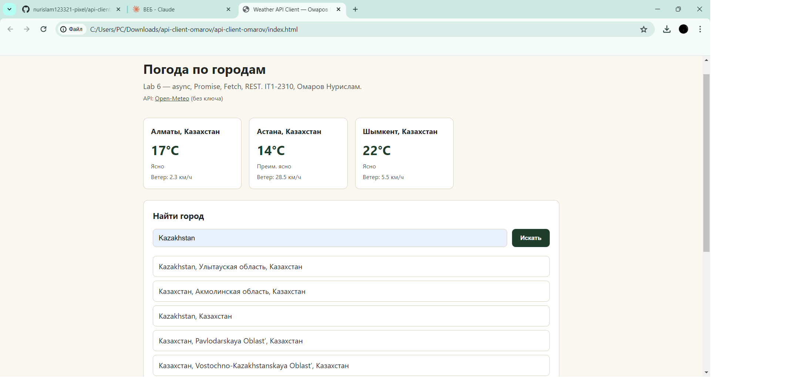

# api-client-omarov

**Автор:** Омаров Нурислам
**Группа:** IT1-2310
**Тема:** Lab 6 — async, Promise, Fetch, REST

## API

[Open-Meteo](https://open-meteo.com) — бесплатный, без ключа и регистрации.

Base URL:
- Геокодинг (название города → координаты): `https://geocoding-api.open-meteo.com/v1`
- Погода по координатам: `https://api.open-meteo.com/v1`

> Изначально использовался REST Countries API, но его открытая версия (v3.1) была отключена
> разработчиками в пользу v5 с обязательным API-ключом — это противоречит условию задания
> «любой API без ключа», поэтому выбран Open-Meteo.

## Как открыть

Попробуй сначала просто открыть `index.html` двойным кликом — Open-Meteo обычно разрешает запросы даже со страницы, открытой как файл.

Если увидишь ошибку в духе "Failed to fetch" / CORS — запусти маленький локальный сервер:

```bash
node server.js
```

Затем открой в браузере: **http://localhost:5500**

## Что сделано

1. **Загрузка через fetch + async/await** — при открытии страницы грузится погода для трёх городов по умолчанию (Алматы, Астана, Шымкент), карточками.
2. **Состояние загрузки / ошибка** — во время запроса показывается «Загрузка…», при сетевой проблеме или `response.ok === false` — понятный текст ошибки прямо на странице, без `alert`.
3. **Поиск с параметром** — форма поиска отправляет новый запрос на геокодинг (`/v1/search?name=...`), а не фильтрует уже загруженный список. Если город не найден, геокодинг возвращает пустой список результатов — это тоже обработано как понятная ошибка.
4. **Детальный просмотр** — клик по городу (из списка по умолчанию или из результатов поиска) делает второй запрос — на этот раз получение погоды по координатам (`/v1/forecast?latitude=...&longitude=...`), и показывает расширенную карточку с влажностью, ветром и временем замера.
5. **Promise.all** — блок «Сравнить погоду» запускает два независимых конвейера запросов (геокодинг + погода для каждого города) одновременно через `Promise.all([...])` и показывает оба результата рядом.

## Зачем await и зачем проверять response.ok

`fetch` возвращает Promise сразу, но без данных — сам ответ сервера приходит позже, и `await` нужен, чтобы «дождаться» этот ответ прежде чем идти дальше по коду, вместо того чтобы работать с ещё пустым объектом. Важный нюанс: `fetch` считает запрос «успешным» (не бросает ошибку) даже если сервер ответил 404 или 500 — ошибка сети (нет интернета, сервер недоступен) это другое дело, а вот «сервер ответил, но плохо» fetch не воспринимает как проблему сам по себе. Поэтому `response.ok` нужно проверять вручную: это `true` только для кодов 200–299, и если он `false`, я сам кидаю `throw new Error(...)`, чтобы это долетело до `catch` и показалось пользователю как понятная ошибка, а не как случайно отрисованные `undefined` на странице. Отдельно пришлось научиться на горьком опыте: даже рабочий, хорошо знакомый API может однажды поменять версию или вообще отключить старую — поэтому `try/catch` вокруг сетевого кода это не формальность для галочки, а то, что реально спасает страницу от падения.

## Скриншот

(screenshots/02.png).

## Использование ИИ

Claude (Anthropic) использовался для генерации структуры запросов к Open-Meteo API, обработки ошибок и логики Promise.all — код разобран и понятен построчно.
